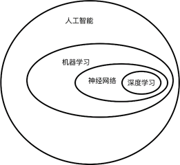
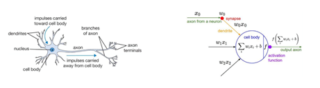
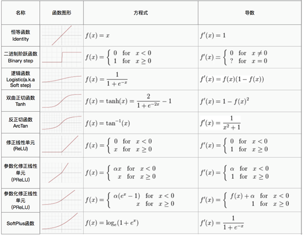
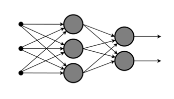

# 2. 神经网络基础

在上一章中，我们介绍了机器学习的相关基础，尤其是知道了监督学习的基本构成因素：数据、模型、策略和算法。在本节，我们将具体学习一种监督学习算法——神经网络。深度学习模型多为深层人工神经网络，所以在进一步探索深度学习在无人驾驶中的应用之前，我们先了解一下神经网络的理论基础和代码实现。

既然说到神经网络和深度学习，先来看看各种概念的关系和范畴，如下图所示：

人工智能是一个很大的概念范畴，机器学习是人们在探索人工智能的过程中的一类方法，神经网络是机器学习中的一类监督学习算法，而深度学习则是将神经网络的层数增多，使用大量数据来建立的一种表示学习算法（关于表示学习，我们会在深度学习一节详细论述）。

## 神经网络基本结构

最初的神经网络的设计借鉴的是生物神经元的结构，我们使用一个数学模型来描述人类的神经元的结构以及接受刺激，被激活然后传递刺激的过程，这一数学模型被称为**感知机（Perceptron）**，下图是生物神经元和感知机的比较：

阶跃函数是一个非线性变换，它属于**激活函数** **(activation function)**的一种，由于阶跃对函数的模拟比较粗糙，所以通常不会使用阶跃函数作为神经元的激活函数，常用的激活函数包括：sigmoid 函数， tanh 函数， ReLU (rectified linear unit)及其变体等，具体的激活函数表达式可参考下图：

感知机是神经网络发展史上一个非常重要的模型，但是使用单个感知机去完成机器学习任务却存在一个致命的问题：单个感知机被证明无法学习到异或（XOR）关系，这一证明在历史上直接影响了神经网络的发展，使得对神经网络的研究陷入了停滞。那么如何才能解决异或逻辑问题呢？答案是使用多层感知机嵌套，这就是现代的神经网络结构。神经网络结构是一个分层的连接结构，它的一个基本形式如下图所示：

神经网络的前一个神经元的尾部（输出）连接到后一个神经元的一个输入，这样便形成了一个层次状的结构，整个神经网络的第一层为**输入层** **(Input Layer)**，它的输入数值便是我们的数据特征，最后一层为**输出层** **(Output Layer)**，中间的若干层为**隐含层（Hidden Layer）** 。熟悉神经网络的基本结构以后，下面我们来看看神经网络这种结构的意义。