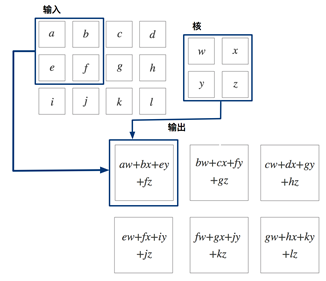
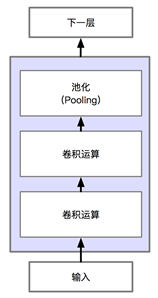
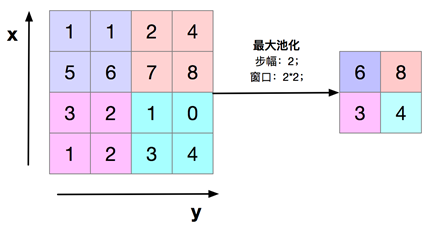
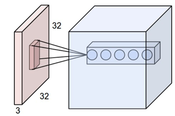

# 3. 卷积神经网络

**卷积（Convolution）**是一种特殊的线性运算，是对两个实值函数的一种数学运算。卷积运算通常用符号 * 来表示。

 

**卷积神经网络是指在网络中至少使用了一层卷积运算来代替一般的矩阵乘法运算的神经网络。**在我们之前的前馈神经网络的例子中，我们使用全连接层作为网络的组成结构，全连接层中的输入实际上是上层的输入乘以权重的累加，本质上是一个矩阵乘法，卷积层实际上就是用卷积运算替代了全连接层中的矩阵乘法，卷积的出发点是通过下述三种思想来改进机器学习系统：

- **稀疏交互(sparse interactions)**

- **参数共享(parameter sharing)**

- **等变表示(equivariant representations)**

## 卷积运算

卷积运算我们已经在前文中讨论过了，在图像处理问题中，我们通常使用的是2维的卷积运算，卷积层中的激活函数起着与全连接网络一样的非线性网络的作用，ReLU 是最常用的激活函数，在此也不再赘述，下面我们来详细讨论一下池化。

池化通常也被称为池化函数，池化函数的定义就是：一种使用相邻位置的总体统计特征来替换该位置的值，池化的理念有点像时序问题中的滑动窗口平均。下图表示一种池化方法——**最大池化（Max Pooling）**：

常用的池化函数主要有**最大池化（Max Pooling）**和**平均池化（Average Pooling）**，分别是输出相邻的矩阵区域的最大值和平均值。不论是哪种池化，都对输入图像中的目标的少量平移具有不变性，因从网络能够进一步学习到应该对哪些变换具有不变性。

**卷积的一些细节**

- **填充（Padding）**
-  **输入输出尺寸**
- **卷积核的深度**

