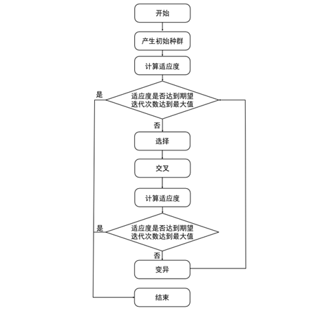
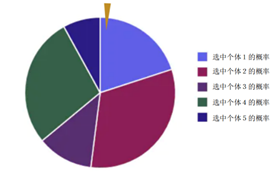
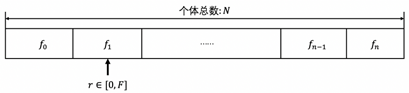
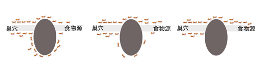

# 4. 程序的优化算法

## 4.1 遗传学的启发

1809年出生于英格兰的查尔斯·罗伯特·达尔文（Charles Robert Darwin），从小便沉迷于户外大自然，飞鸟走兽之类的东西，长大后的达尔文在父亲的资助下去了南美洲，时年27岁的达尔文勘察结束后便开始写《物种起源》，并于1859年发表了《物种起源》一书，他在书中推断地球上现存的生物都由共同祖先发展而来，它们之间有亲缘关系，并提出自然选择学说解释进化的原因，从而创立了科学的进化理论，揭示了生物发展的历史规律；然而达尔文并没有对**遗传**做出解释，但在布隆恩修道院担任神父的奥地利帝国遗传学家格雷戈尔·孟德尔（Gregor Johann Mendel）注意到了这一问题，孟德尔从小便对植物的生长和开花非常感兴趣，于是苦心钻研技术，发现了遗传学定律，然而生前他的研究并没有得到大家的广泛认可，直到他逝世16年才被世人发现遗传学的真谛；此外，杜布尚斯基等人的综合进化论综合了细胞遗传学、群体遗传学以及古生物学等学科的成就，进一步发展了进化理论。

在遗传学定律未提出之前，人们对于“孩子为什么像父母”这样的遗传现象并没有明确的科学解释和理论依据，也不明白动植物子代和父代之间的基因关系是什么样的？直到1854年，孟德尔用34个豌豆株进行了7组具有单个变化因子的一系列杂交试验，并在8年实验的基础上提出了著名的“3:1”定律，即“动物的隐性遗传因子在从亲代到后代的传递中，它可以不表现。但是它是稳定的，并没有消失。”，并在1865年催生了遗传学诞生的著名定律—分离定律和自由组合定律，后来统称为“孟德尔遗传规律”，这就是关于遗传最早的科学解释。

## 4.2 遗传算法

遗传算法（Genetic Algorithm，GA）[13]是一种借鉴生物界自然选择和自然进化机制的搜索方法，它是通过对个体的基因进行复制、交叉、变异等过程操作完成，最初由美国的约翰·霍华德（John Holland）于20世纪70年代提出，其根据大自然中生物体进化规律设计提出的一种自然选择和遗传学机理的进化过程模型，最早可追溯到20世纪60年代初期。1967年，约翰·霍华德的学生巴格利（Bagley）在他的博士论文中首次提出了遗传算法这一术语，并讨论了遗传算法在博弈中的应用，但早期研究缺乏带有指导性的理论和计算工具。20世纪80年代后，遗传算法进入兴盛发展时期，被广泛应用于自动控制、生产计划、图像处理、机器人等各个研究领域。

遗传算法通过数学和计算机的方式将问题的求解过程转换成类似生物进化中的染色体基因的交叉、变异等过程。一般的，它通过使用随机化技术对一个被编码的基因参数空间进行高效搜索得到最优解。其中选择、交叉和变异构成了遗传算法的基本遗传操作，在计算系统中由参数编码、初始群体的设定、适应度函数的设计、遗传操作设计、控制参数设定这五个部分组成，过程如图4-1所示：

## 4.3 交叉变异

通常情况下，遗传算法中可以有很多个体，为了能够找到最合适的种子进行下一步交叉变异，就需要**从旧群体中以一定概率选择优良个体，通过新的个体来组成新的种群，以繁殖得到下一代个体**，一般的个体被选中的概率通常和适应度值有关，个体适应度值越高，被选中的概率越大，本部分将介绍四种常见的适应度选择方法：

（1）轮盘赌选择

（2）随机遍历选择

随机遍历选择是由詹姆斯·贝克（James Baker）等人提出的一种根据给定概率以最小化波动概率的方式选择个体的方法，即在上文的轮盘上有p个等间距的点进行旋转，随机遍历选择使用一个随机值在等间隔的空间间隔内来选择个体。

（3）概率选择

（4）蒙特卡罗选择

蒙特卡罗选择方法从给定的种群中随机选择个体，因此蒙特卡罗选择执行的是随机搜索而不是定向搜索。一般情况下，蒙特卡罗选择用于度量其他选择器的性能，通常选择器的性能要优于蒙特卡罗选择的性能。

遗传算法的最后一步是变异，相对来说生物中的变异比较少见，至少对生物有显著影响的变异来说概率比较低，大概只有2%的可能性。通常情况下，我们并不知道变异率是多少是最好的，变异一般取决于种群的规模，编码以及其他因素，在一个问题中，变异率的选择直接影响生物进化的结果。

## 4.3 进化算法

在遗传的基础上接下来我们解释第二个重要的概念：“进化（Evolution）”，它是在子代个体继承父代的优良基因后，以适应实际的环境而做出来的基因变化，地球上的生命，从原始多细胞动物到出现脊索动物，进而演化出高等脊索动物──脊椎动物。脊椎动物中的鱼类又演化到两栖类再到爬行类，从中分化出哺乳类和鸟类，哺乳类中的一支进一步发展为高等智慧生物，这就是自然界中生物的进化过程，进化算法是在遗传算法的基础上开始不断演化，最终形成优良的品种的算法。

## 4.4 其它进化算法

**粒子群优化算法**（Particle Swarm Optimization，PSO）是在1995年由埃伯哈特（Eberhart）博士等人提出的，它的思路来源于对鸟群捕食行为的研究，其核心是利用群体中的每个个体对其他个体的信息共享，从而使得整个群体从无序到有序的的一个过程演化来获得团体目标的最优解。粒子群优化算法就是基于此构建的一种优化模型，其流程如图4-12所示。它与其他现代优化方法相比的一个明显特色就是所需要调整的参数很少、简单易行，收敛速度快，已成为现代优化方法领域研究的热点。

我们设想这么一个场景：一群鸟进行觅食，而远处有一片玉米地，所有的鸟都不知道玉米地到底在哪里，但是它们知道自己当前的位置距离玉米地有多远。那么找到玉米地的最佳策略是什么？

（1） 搜寻目前离食物最近的鸟的周围区域

（2） 根据自己飞行的经验判断食物的所在。

蚁群算法（Ant Colony Optimization, ACO）是一种用来在图中寻找优化路径的算法。它由马可‧朵丽哥（Marco Dorigo）于1992年提出，其灵感来源于蚂蚁在寻找食物过程中发现路径的行为，如下图所示：

他在研究蚂蚁觅食的过程中，发现蚁群整体会体现一些智能的行为，例如蚁群可以在不同的环境下，寻找最短到达食物源的路径。后经进一步研究发现，这是因为蚂蚁会在其经过的路径上释放一种可以称之为“信息素”的物质，蚁群内的蚂蚁对“信息素”具有感知能力，它们会沿着“信息素”浓度较高路径行走，而每只路过的蚂蚁都会在路上留下“信息素”，这就形成一种类似正反馈的机制，这样经过一段时间后，整个蚁群就会沿着最短路径到达食物源了。由上述蚂蚁找食物模式演变来的算法，即是蚁群算法，其本质上是进化算法中的一种启发式全局优化算法。

算法在初始期间给信息素一个固定的浓度值，在每一次迭代完成之后，所有出去的蚂蚁回来后，会对所走过的路线进行计算，然后更新相应的边的信息素浓度。很明显，这个数值肯定是和蚂蚁所走的长度有关系的，经过一次次的迭代，近距离的线路的浓度会很高，从而得到近似最优解。

本章内容从物种起源开始阐述，解释了遗传算法的来龙去脉，并以豌豆交叉为例子重新阐述基因的交叉编译过程，逐渐过渡到计算机中通过二进制对遗传算法的编码表示方法。随后对遗传算法中的交叉、变异等进行解释，使用了进化算法对一元和多元函数最优解进行求解，同时对常见的进化算法进行了简单概述。